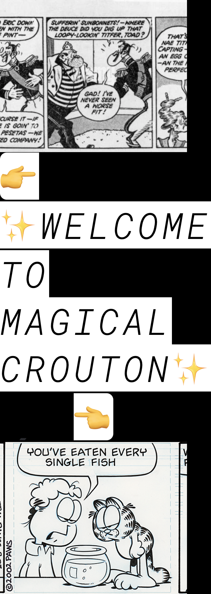
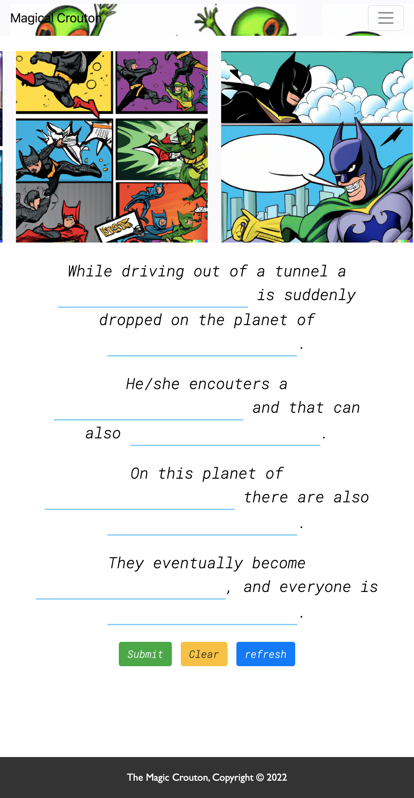
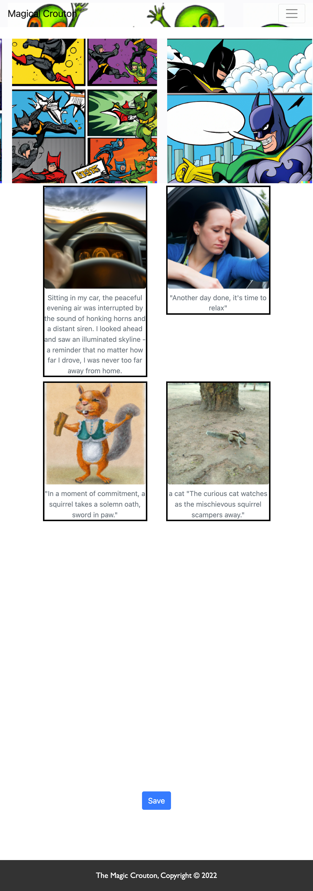
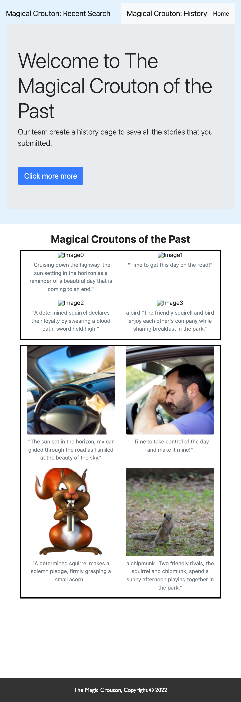
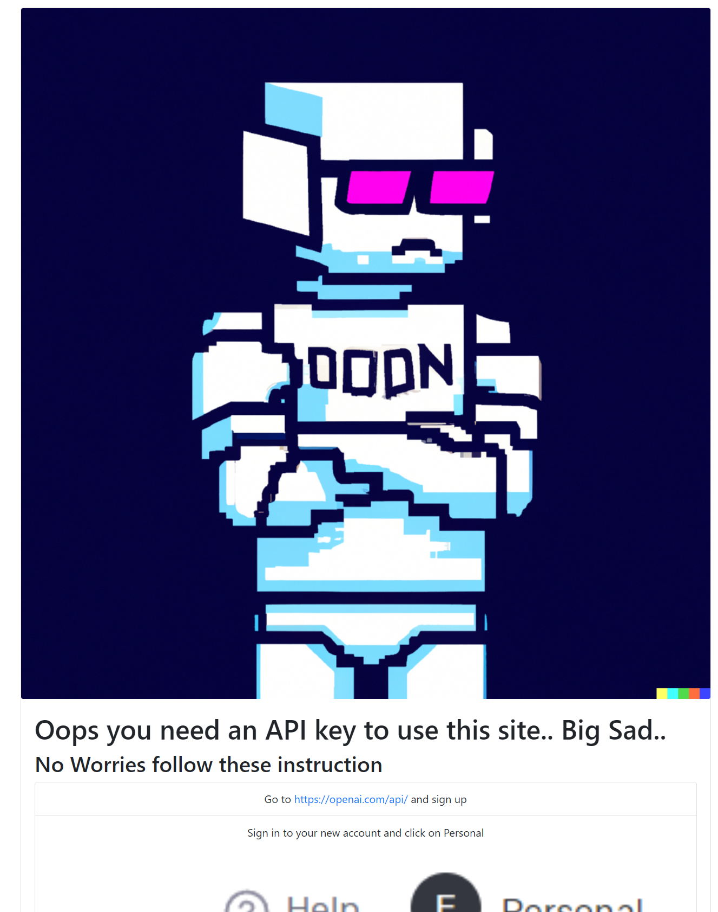

# Project 1

## Description

This app leverages open Ai's DALLE API and Chat GPT model 3 to generate images and relative caption based on user input. user input is taken in the form of a madlib where the user inputs are placed into a premade template 'payloadGuide' to feed both the DALLE and Chat GPT APIs which then the return values are placed on screen as a comic book.

## Contributors

Eugene P, Mark G, Tim A, Konny H, David O

## Usage

As a user I want to be able to generate images and accompanying
Learn to pronounce captions from my input. The captions must be coherent and related to each generated image regardless of what type of input is given.

Users will be guided to create an AI generated 4 pane comic. This will be achieved by using a mad lib style forms generated from 4 story variations. Though there is only four variations, The Magical Crouton leverages AI to generate unique story illustration with acompaying caption.

To use this site you will need to have an open AI api key. the site will automatically prompt the user if no key is detected. API keys are stored in local memory on user side browser.

## Site Links
Live Site URL: https://magiccrouton.github.io/theMostMagicalCrouton/
Site Repo: https://github.com/MagicCrouton/theMostMagicalCrouton

## Credits

Open Ai-
DALLE API
Chat GPT

## License

Please refer to the LICENSE in the repo.

## Screenshots

Home Page

Story Page
 

Comic Page

History Page

User API Setup Page
